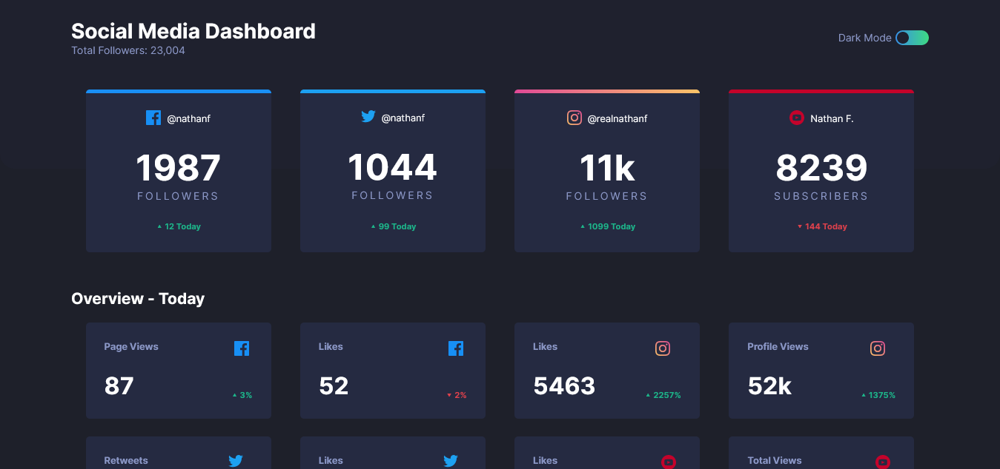
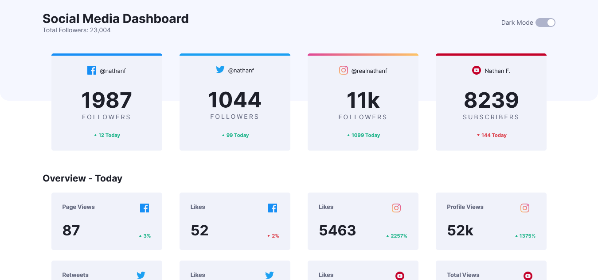

# Frontend Mentor - Social media dashboard with theme switcher solution

This is a solution to the [Social media dashboard with theme switcher challenge on Frontend Mentor](https://www.frontendmentor.io/challenges/social-media-dashboard-with-theme-switcher-6oY8ozp_H). Frontend Mentor challenges help you improve your coding skills by building realistic projects.

## Table of contents

- [Overview](#overview)
  - [The challenge](#the-challenge)
  - [Screenshot](#screenshot)
- [My process](#my-process)
  - [Built with](#built-with)
  - [What I learned](#what-i-learned)

## Overview

### The challenge

Users should be able to:

- View the optimal layout for the site depending on their device's screen size
- See hover states for all interactive elements on the page
- Toggle color theme to their preference

### Screenshot




## My process

### Built with

- CSS Grid
- _"Inicialmente desenvolvido com Sass (Porém para ser possível a mudança dinâmica do tema com variavéis foi nessecário voltar para o CSS padrão)"_

### What I learned

```js
const initialColors = {
  bg: window.getComputedStyle(body).getPropertyValue("--bg"),
  topBgPattern: window
    .getComputedStyle(body)
    .getPropertyValue("--top-BgPattern"),
  cardBg: window.getComputedStyle(body).getPropertyValue("--card-Bg"),
  graishText: window.getComputedStyle(body).getPropertyValue("--graish-Text"),
  darkText: window.getComputedStyle(body).getPropertyValue("--dark-Text"),
  hover: window.getComputedStyle(body).getPropertyValue("--hover"),
};
};
```
